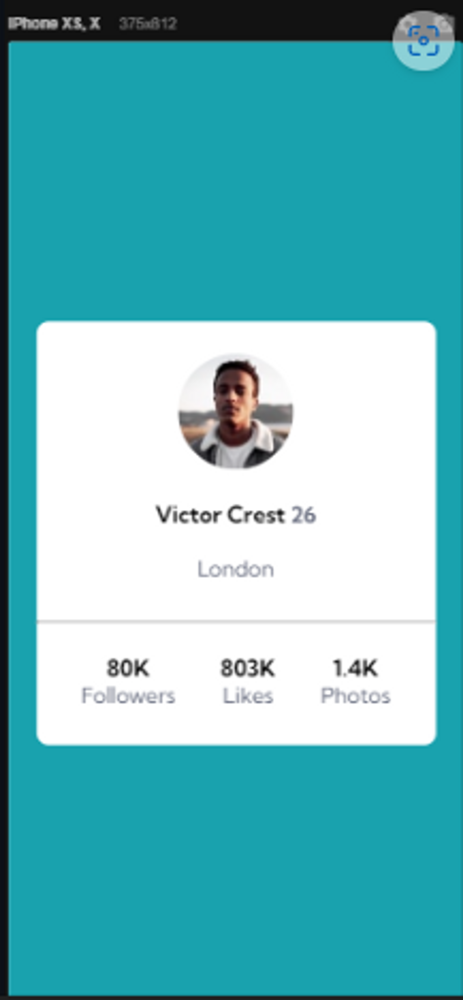

### Profile Card Project 💡
- Welcome and thanks for visualizing my work. This project was inspiried by FrontEnd Mentor Challenge. 
## Layout
- This was the layout I got inspired by when doing this project. Of Course I changed, but I tried to keep the sintaxe and the measures.
    
    -   Mobile Layout
    
    
    - Desktop Layout

    

## Tools
- I used HTML, CSS and created the responsive interface with flexbox and media queries. 

## Contact

- If you have anything to add, please feel free to give me a heads up.